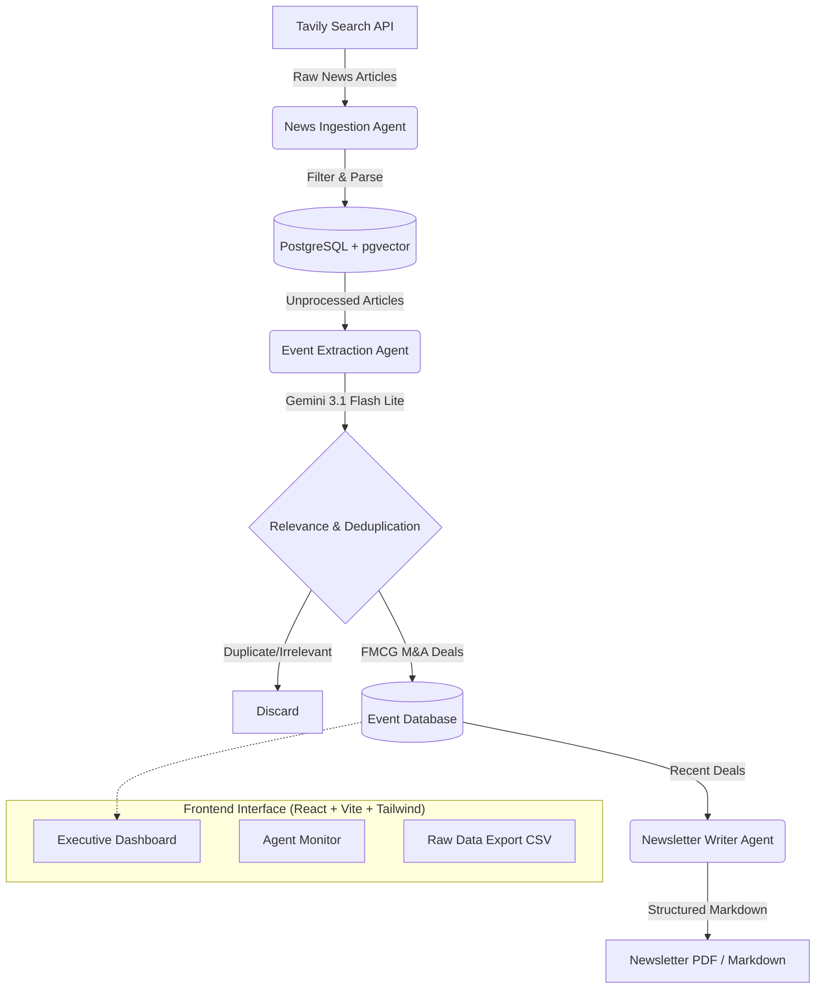

# FMCG Intel - Market Intelligence Agent

A real-time AI agent pipeline for sourcing, collating, and analyzing FMCG industry M&A and investment activity.

## Architecture Diagram



## Core Pipeline 

The system operates autonomously using a multi-agent pipeline architecture:

1. **Ingestion (`News Ingestion Agent`)**: Periodically queries public search APIs (Tavily) with specialized queries targeting FMCG M&A activities (e.g., "FMCG acquisition", "Beverage company investment"). Fetches raw article content, cleans it, and stores it in the database.
2. **Cleaning & Extraction (`Event Extraction Agent`)**: Feeds raw article text to Gemini. The LLM extracts structured data (Acquirer, Target, Deal Value, Industry, Date).
3. **Scoring & Verification (`Financial Verification Agent`)**: Cross-references the extracted deal against multiple sources. Calculates a `confidence_score` based on the number of independent verified sources reporting the same event.
4. **Newsletter Generation (`Newsletter Writer Agent`)**: Aggregates highly-scored events from the past week and uses Gemini to draft a structured, business-ready newsletter summarizing the M&A landscape, emerging trends, and top deals.

## Relevance and De-duplication Logic

**Relevance Check**: 
The extraction agent is provided with strict zero-shot prompting constraints. It evaluates each article against two criteria:
1. **Industry**: Must involve Fast-Moving Consumer Goods (Food, Beverage, Personal Care, Household). Pharma, Heavy Industry, and B2B Tech are explicitly rejected.
2. **Event Type**: Must involve a tangible financial event (M&A, acquisition, joint venture, major investment). General product launches or earnings reports are rejected.

**De-duplication**:
When a new deal is extracted, the agent compares it against existing events in the database using Entity Resolution (matching Acquirer and Target names) and Semantic Similarity. If an article refers to an already known event (e.g., "Unilever acquires XYZ" reported by a new publisher), it is NOT created as a new event. Instead, the new article is appended as an additional `source` to the existing event, which subsequently increases the event's `confidence_score`.

## Sensible Credibility and Assumptions
- **Trust Scoring**: Events reported by only a single low-tier source start with a low confidence score (e.g., 30%). As Tier-1 financial outlets (Reuters, Bloomberg, WSJ) report the same deal, the score approaches 100%.
- **LLM Hallucination Mitigation**: The LLM is strictly instructed to return `null` for any fields (like Deal Value) that are not explicitly stated in the text, preventing it from guessing or hallucinating numbers.

## Getting Started

### Backend (FastAPI + PostgreSQL + Celery)
```bash
cd backend
pip install -r requirements.txt
uvicorn app.main:app --reload
```

### Frontend (React + Vite)
```bash
cd fmcg-frontend
pnpm install
pnpm run dev
```

### Environment Variables Required
- `GEMINI_API_KEY`
- `TAVILY_API_KEY`
- `DATABASE_URL` (PostgreSQL)
